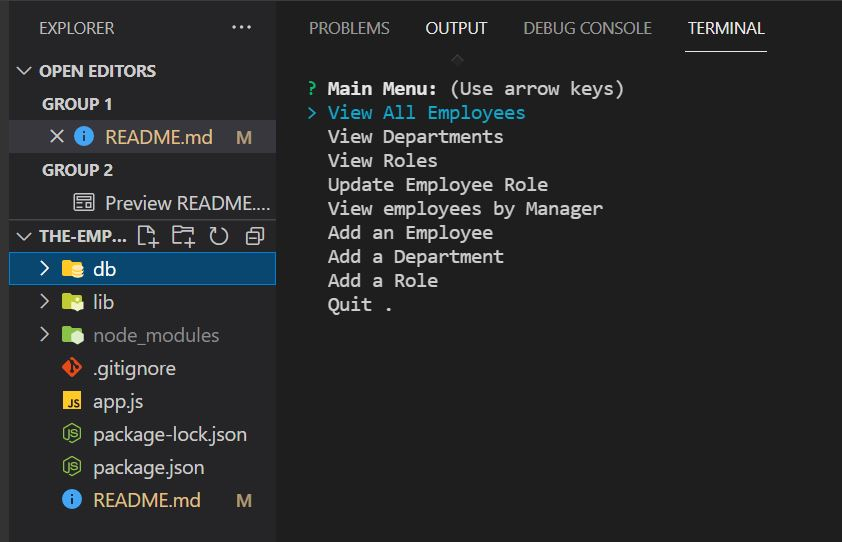
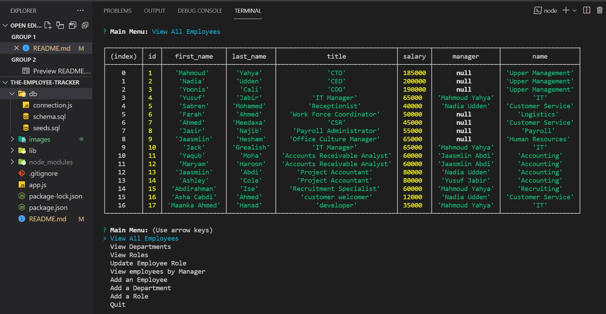
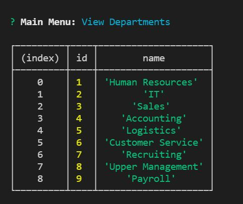
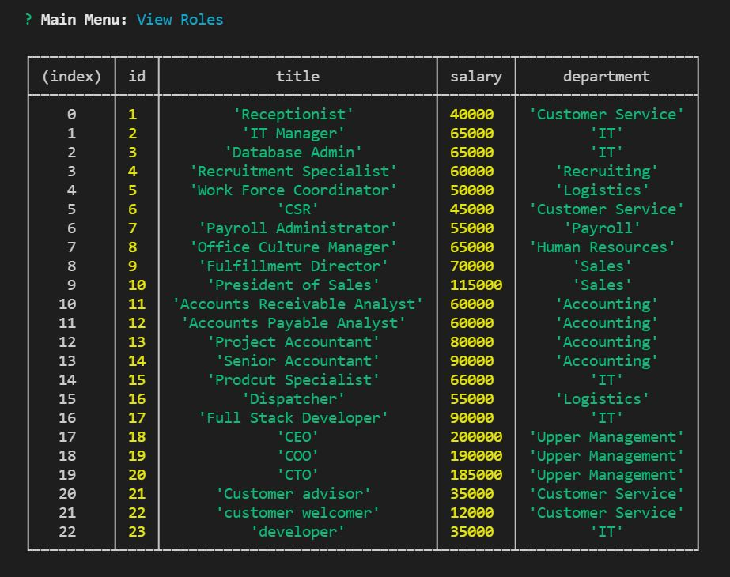

[](https://opensource.org/licenses/MIT)

# the-employee-tracker

# Description 
Node.js command line based employee management system with basic commands to add and manage Employees, Roles and Departments.

# Installation and Usage
Installation: 
* Install the required packages using ```npm install``` in the root directory (location of packages.json)

Usage 
* Application is run by executing "node app.js" The user is brought to a main menu with a list of commands that can be executed by using the arrows. Some options have further choices and prompts to interact with the system.

# Links
Link to a demo video: 

Link to the repository:

# Screenshots








# Credits
Npm Documention: https://docs.npmjs.com/

The Net Ninja: https://www.youtube.com/channel/UCW5YeuERMmlnqo4oq8vwUpg


